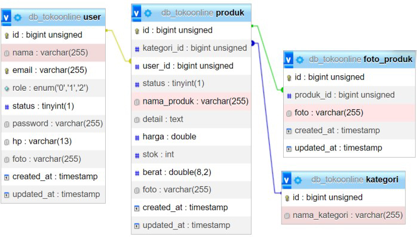
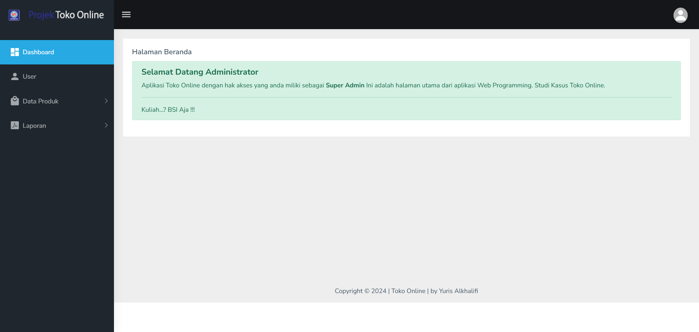
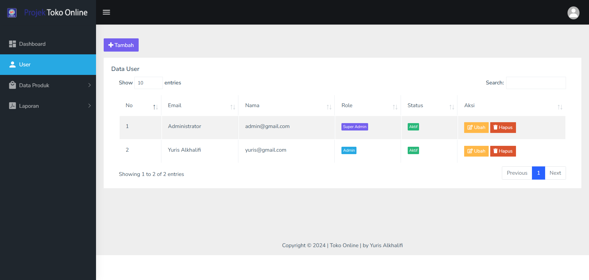
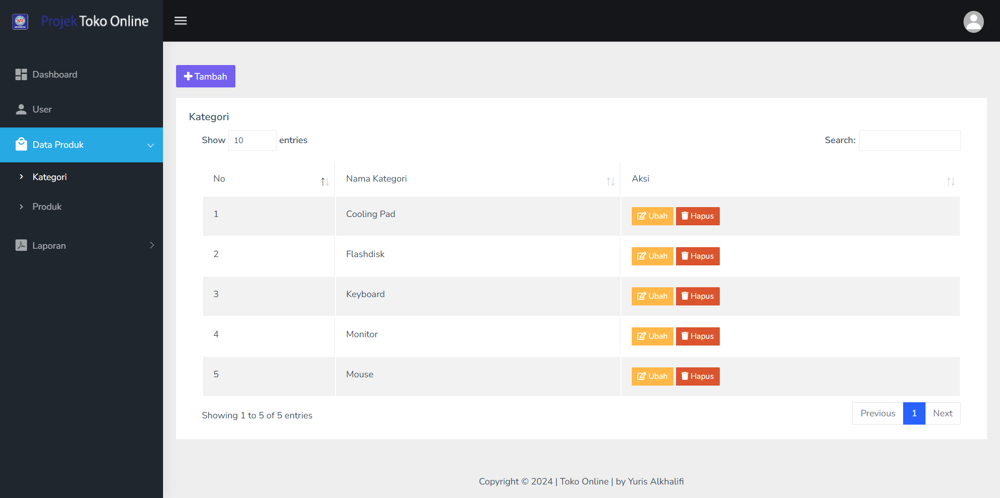
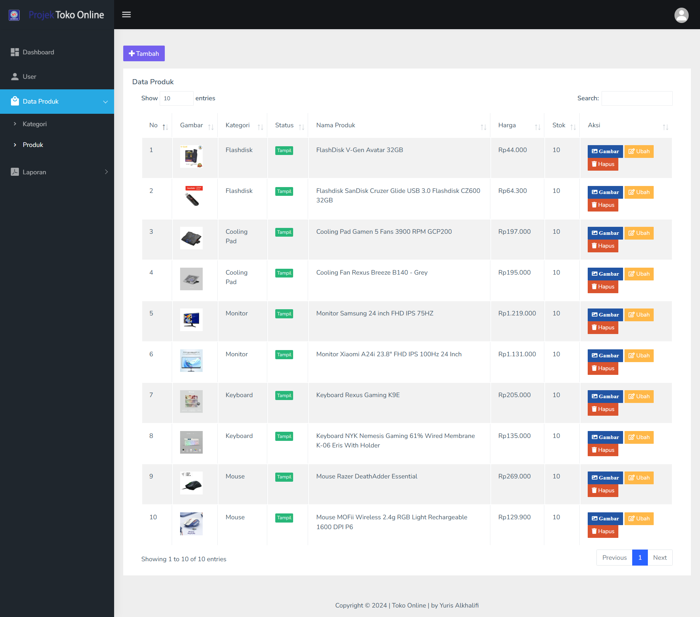
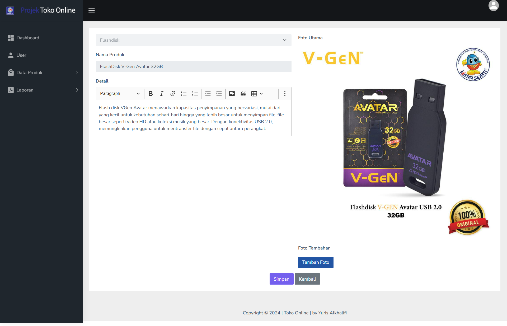
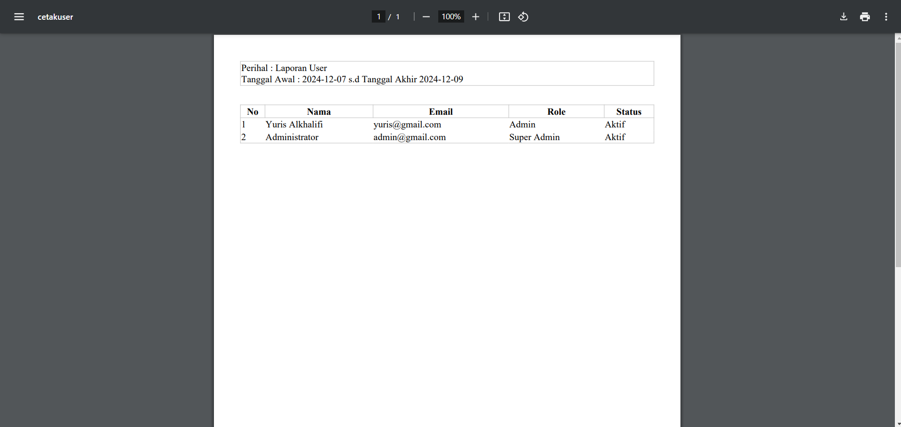
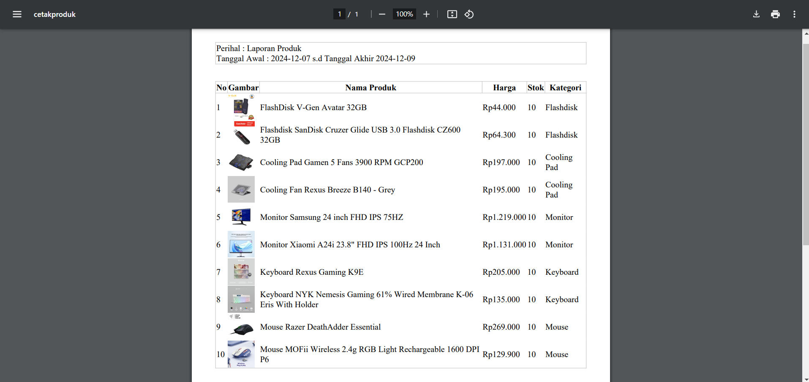
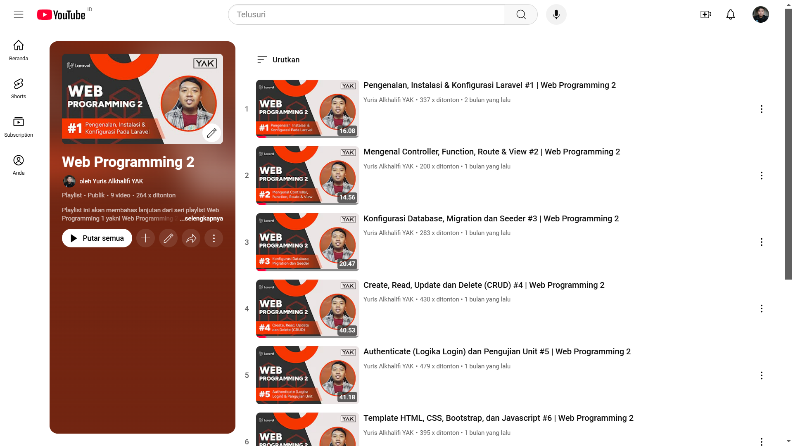

# Toko Online

<p align="center"></p>
<p align="center"></p>


## Pengenalan Project

Project ini merupakan project Laravel pada mata kuliah Web Programming II di Universitas Bina Sarana Informatika yang bertemakan tentang Toko Online.

## Relasi Tabel
<p align="center"></p>

## Pra-Install
Sebelumnya pastikan menginstall terlebih dahulu kebutuhan sistem untuk menggunakan project ini.
- [x] Git
- [x] Composer
- [x] Code Editor <code>VS Code, Sublime Text atau sejenisnya</code>
- [x] Web Server <code>Laragon, Xampp atau sejenisnya</code>
- [x] Web Browser <code>Chrome, Mozilla atau sejenisnya</code>
- [x] Node.js <code>(opsional)</code>

## Cara Install
1. Cloning repository ini melalui terminal. Tunggu hingga selesai cloning.
```
git clone https://github.com/yuris60/TokoOnline.git
```
2.  Buka project menggunakan Code Editor, lalu inisiasi dependensi composer melalui terminal.
```
composer install
```
3. Duplikat file `.env.example` menjadi `.env` dan konfigurasikan koneksi database menjadi seperti ini pada file `.env`
```
DB_CONNECTION=mysql
DB_HOST=127.0.0.1
DB_PORT=3306
DB_DATABASE=db_tokoonline
DB_USERNAME=root
DB_PASSWORD=
```
4. Generate key aplikasi pada env melalui terminal.
```
php artisan key:generate
```
5. Generate Storage Link melalui terminal agar dapat mengakses storage.
```
php artisan storage:link
```
6. Migrasikan tabel beserta seeder melalui terminal.
```
php artisan migrate:fresh --seed
```

## Screenshot
<table width="100%">
<tr>
<td><h3 align="center">Login</h3></td>
<td><h3 align="center">Home</h3></td>
</tr>
<tr>
<td><h3 align="center">User</h3></td>
<td><h3 align="center">Kategori</h3></td>
</tr>
<tr>
<td><h3 align="center">Produk</h3></td>
<td><h3 align="center">Tambah Foto Produk</h3></td>
</tr>
<tr>
<td><h3 align="center">Laporan User</h3></td>
<td><h3 align="center">Laporan Produk</h3></td>
</tr>
</table>

## Video Tutorial
Project ini sudah didokumentasikan dan dipublikasi melalui akun Youtube. Silakan kunjungi link <a href="https://www.youtube.com/playlist?list=PLQ-zS5A7YYio0505gQRdu9v4CJT--WSW2">berikut</a>.
<p align="center"><a href="https://www.youtube.com/playlist?list=PLQ-zS5A7YYio0505gQRdu9v4CJT--WSW2" target="_blank"></a></p>

## Lisensi

Project ini mengacu pada modul praktik dari mata kuliah Web Programming II Universitas Bina Sarana Informatika (UBSI). Project ini bersifat open-source untuk edukasi.
<blockquote>Kuliah...? BSI AJA !!</blockquote>
